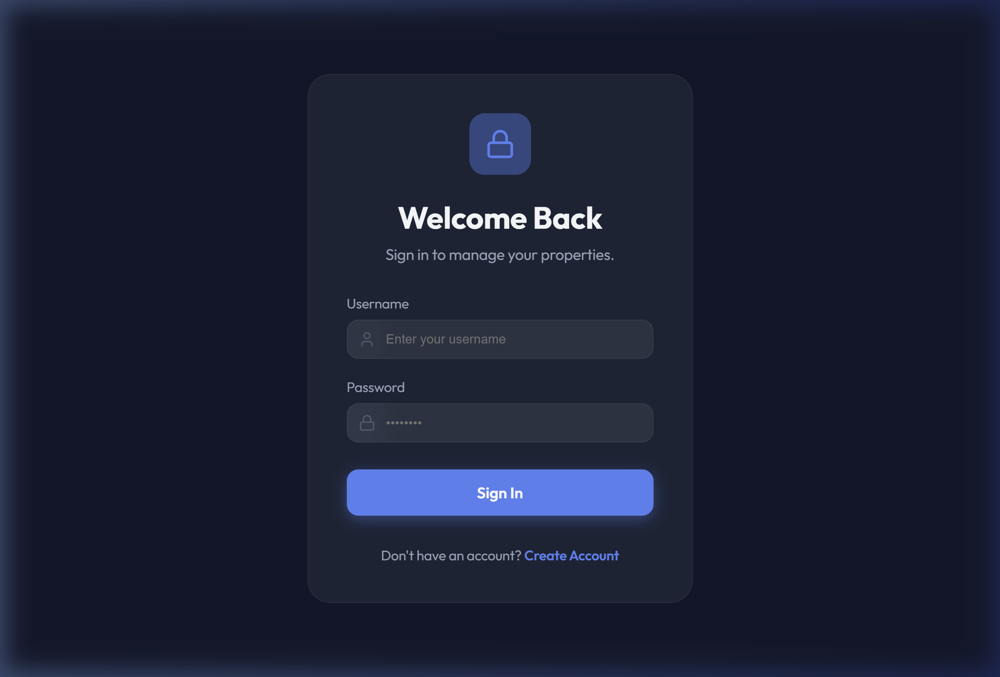

# Deployment Walkthrough: Rent & Lease Automation System

The application is now successfully deployed and live on Oracle Cloud.

## Infrastructure Summary
- **Instance**: `VM.Standard.E2.1.Micro` (Oracle Cloud Always Free).
- **Public IP**: `132.226.132.245`
- **Security**: Shielded Instance enabled; Ports 22, 80, and 443 open.
- **Resource Management**: 4GB Swap file configured to handle the 1GB RAM limit.

## Application Architecture
1.  **Backend**: FastAPI running via Systemd service (`rent_auto.service`).
2.  **Frontend**: React (Vite) built on Windows and served as static files by Nginx.
3.  **Database**: PostgreSQL installed locally on the Ubuntu host.
4.  **Reverse Proxy**: Nginx handles SSL (ready for HTTPS) and proxies `/api` requests to the backend.

## Validation Results

### 1. Website Access
The application is accessible at [http://132.226.132.245](http://132.226.132.245).

### 2. Backend Health
- Systemd service status: **Active (running)**.
- Database migrations: **Successfully applied**.
- API Docs: Accessible at `/api/docs`.

### 3. Networking
- Public IP persistence: **Reserved Public IP** ensures the address won't change on reboot.

---

## Post-Deployment Maintenance Tips
- **Logs**:
    - Backend: `sudo journalctl -u rent_auto -f`
    - Nginx: `sudo tail -f /var/log/nginx/access.log /var/log/nginx/error.log`
- **Updates**:
    - To update code: `git pull`, then `sudo systemctl restart rent_auto`.
    - To update frontend: Re-build on Windows and `scp` the `dist` folder to `/var/www/rent_automation/`.
